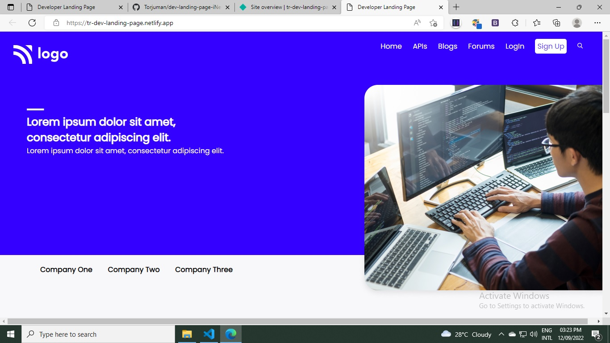
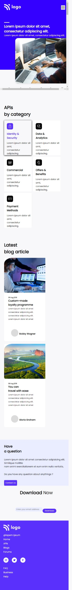

# Hi, This is Torjuman Rimon.

This is a Responsive landing page which is most like "Developer Landing Page". It is one of the live class project from iNeuron's Full Stack JavaScript Bootcamp given by **[Hitesh Sir](https://github.com/hiteshchoudhary)**

## Image from this project

### Desktop view

### Mobile view

All the images, icons and HTML file was given to me. And I need to make this home page as it was instructed.

- **What I have learnd in this project**

  - Full web page with Header, Hero Section and Footer
  - Media Queries
  - Icons placement
  - Mobile view
  - Flexbox
  - Wrap with flex
  - Hide elements at certain break point
  - Card design
  - Background image plcement

- **Time needed to finish this project**

  - 6 : 00 hours

- **[Live Link](https://tr-dev-landing-page.netlify.app/)**

# Tech used

 

